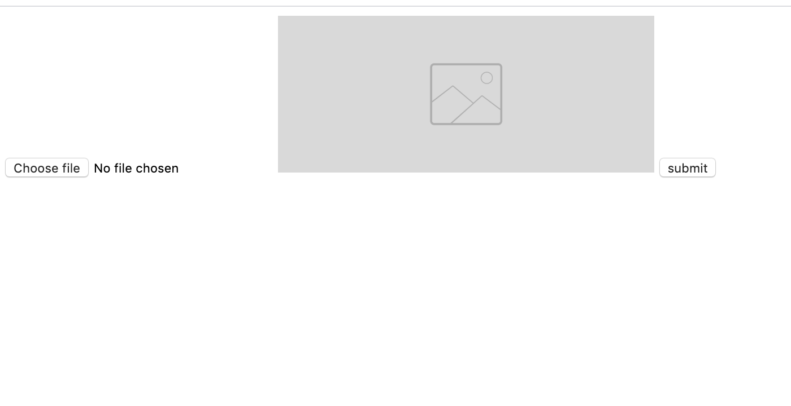

# Object-recongization-rest-api

Rest based Api for object Recognition ~ to AWS Rekognization.

###Idea is to build python based docker image which will expose Rest api to upload image and will give list of objects detected with new image.

### Steps to build python based docker image

* Install below pre-requisite components.
```
sudo apt install -y python3-pip
sudo apt install -y python3-opencv

pip3 install flask
pip3 install -U tensorflow keras opencv-python && pip3 install imageai
```

*


* Build object-detection docker image
```
cd object-detection
docker build -t object-detection .
```


* Lets understand the docker file
```
FROM ubuntu
VOLUME /app
WORKDIR /app
COPY . .
RUN apt-get update
RUN apt-get install -y python3-pip
RUN pip3 install -U tensorflow keras opencv-python && pip3 install imageai
RUN apt install -y wget
RUN wget https://drive.google.com/file/d/1eT9uzsaV7koTex51G11v6c41MEND_3_B/view?usp=sharing
RUN pip3 install flask
RUN apt install -y vim
RUN apt install -y curl
EXPOSE 5000
ENTRYPOINT python3 ./server.py
```

* Run object-detection
```
docker run -d -p3030:3030 object-detection
```
* Access http://localhost:5000



#### Note::: Download yolo.h5 from https://drive.google.com/file/d/1eT9uzsaV7koTex51G11v6c41MEND_3_B/view?usp=sharing

Happy Learning !!!
