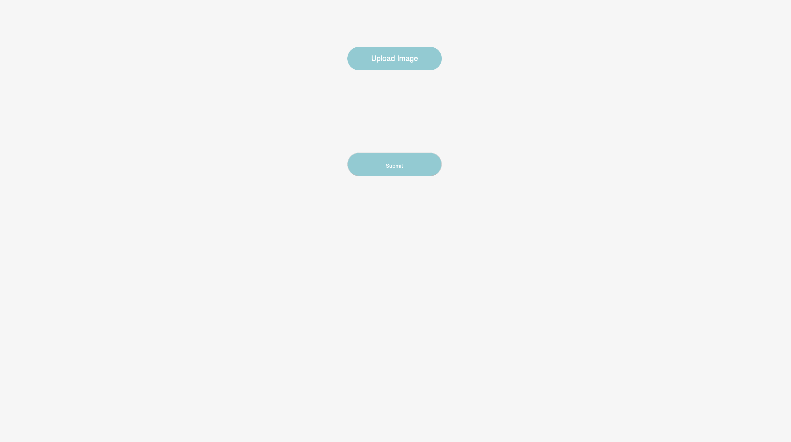
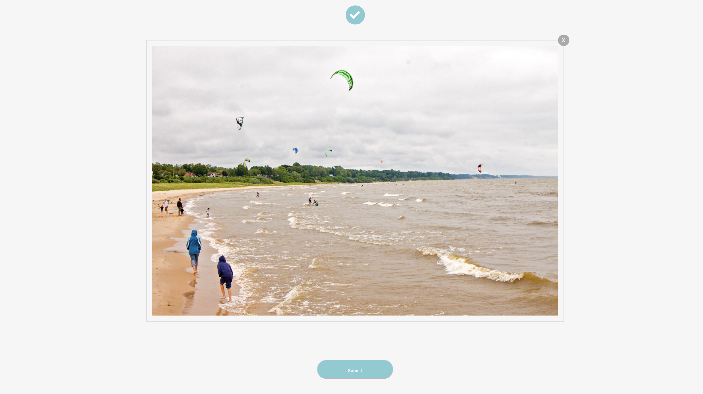
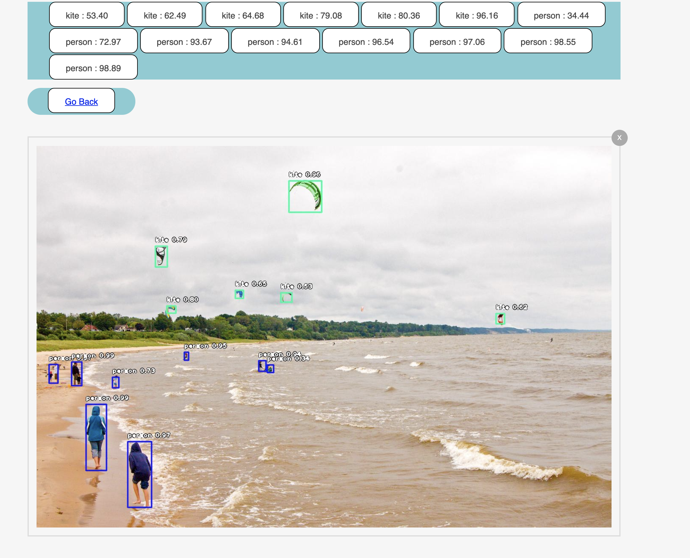

# Object-recongization-rest-api
Rest based Api for object Recognition similar to AWS Rekognization.

## Idea is to build python based docker image which will expose Rest api to upload image and will give list of objects detected with new image.

### Steps to build python based docker image

* Checkout codebase
```
git clone https://github.com/RitreshGirdhar/Object-recognition-rest-api.git
cd Object-recognition-rest-api/
```

* Let's build object-detection docker image
```
cd object-detection
docker build -t object-detection .
```

* Run docker image object-detection
```
docker run -d -p80:80 object-detection
```

### Let's test the application

* Open Browser and hit http://localhost/


* Upload Image and wait


* See the list of object detected with probability


#### Note::: use below command to download yolo.h5 
```
wget --no-check-certificate 'https://docs.google.com/uc?export=download&id=1eT9uzsaV7koTex51G11v6c41MEND_3_B' -O yolo.h5
or 
wget --load-cookies /tmp/cookies.txt "https://docs.google.com/uc?export=download&confirm=$(wget --quiet --save-cookies /tmp/cookies.txt --keep-session-cookies --no-check-certificate 'https://docs.google.com/uc?export=download&id=1eT9uzsaV7koTex51G11v6c41MEND_3_B' -O- | sed -rn 's/.*confirm=([0-9A-Za-z_]+).*/\1\n/p')&id=1eT9uzsaV7koTex51G11v6c41MEND_3_B" -O yolo.h5 && rm -rf /tmp/cookies.txt
```

### Happy Learning !!!
